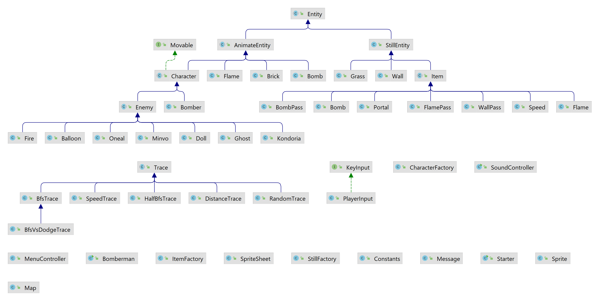

<h1 align="center"><project-name>Bomberman</h1>

<project-description>Bài tập lớn môn lập trình hướng đối tượng

## Author
- [Phạm An Đức Vinh](https://www.facebook.com/phamanducvinhuet/)
- [Nguyễn Đức Thuận](https://www.facebook.com/floweronstone)

## Built With
- [Java18](https://www.oracle.com/java/technologies/javase/jdk18-archive-downloads.html)

## Game engine
- [JavaFx](https://openjfx.io/openjfx-docs/)

## Tools build menu game
- [SceneBuilder](https://gluonhq.com/products/scene-builder/)

## Demo game
 
- Load map
- Di chuyển  Bomber theo sự điều kiện của người chơi
- Tự động di chuyển các Enemy ( Balloon di chuyển ngẫu nhiên)
- Xỷ lý va chạm cho các đối tượng  Bomber, 
Enemy,
 Wall, 
 Brick, 
 Bomb
- Xỷ lý bomb nổ 
- Xử lý Khi bomber sử dụng các Item và khi di vào vài vị trí Portal
    +  Cổng dịch chuyển sang màn mới
    +  Chạy nhanh hơn
    +  Bomb nổ to hơn
    +  Đặt được nhiều bomb cùng lúc chưa nổ nhiều hơn
- [Video demo game](https://drive.google.com/file/d/1ZdyyQUwcMcBzrQsOe-bswLOe13SIa8M-/view?usp=sharing)

## Game detail

- Xây dựng cây kế thừa
- Phát triển thêm hệ thống âm thanh, hiệu ứng bomb nổ, giết quái, nhạc nền ... có thể bật tắt âm thanh tùy ý.
- Phát triển thuật toán tìm đường cho các enemy - xử dụng thuật toán [BFS](https://www.geeksforgeeks.org/breadth-first-search-or-bfs-for-a-graph/)
- Phát trển thêm 5 loại quái vật
  +  Oneal, nếu đi vào bán kính lãnh địa của nó, 
  nó sẽ đuổi theo bạn ([demo](https://drive.google.com/file/d/1_kiINtl6rdGVYV6d2ehMcS08AP1hpQfH/view?usp=sharing))
  +  Doll, 
  nhanh khi nó ngửi thấy người chơi
  và tìm đến chỗ người chơi, nếu không nó sẽ đi chậm ([Demo](https://drive.google.com/file/d/1n1DDXxa5AT8GyLaHpiY1S0y1q6r74Hcq/view?usp=sharing))
  +  Kondoria, quái vật này có thể tìm được người chơi, 
  có thể bò được qua tường ([Demo](https://drive.google.com/file/d/11JeClFZ8gqWHJNhrxkHd30PFBsKHx9Qh/view?usp=sharing))
  +  Ghost, quái vật này có thể tìm được người chơi, né bomb 
  có thể đi xuyên tường và đi qua bomb và có thể tàng hình ([Demo](https://drive.google.com/file/d/1ZKlnT9un96Ma9xke8p9ShJ_AaSBMrtf9/view?usp=sharing))
  +  Minvo, quái vật này có thể tìm được người chơi, đi xuyên tường,  
  né bomb, và phun lửa ([Demo](https://drive.google.com/file/d/1LZ2rDyPdu02EJU1RcscFNmWuyVyXagog/view?usp=sharing))
- Phát triển thêm 3 loại Item mới với sức mạnh lớn
  +  giúp người chơi có thể đi xuyên qua bomb khi chưa nổ
  +  giúp người chơi không bị lửa từ bomb nổ thiêu đốt
  +  giúp người chơi đi xuyên qua được các khối gạch 
